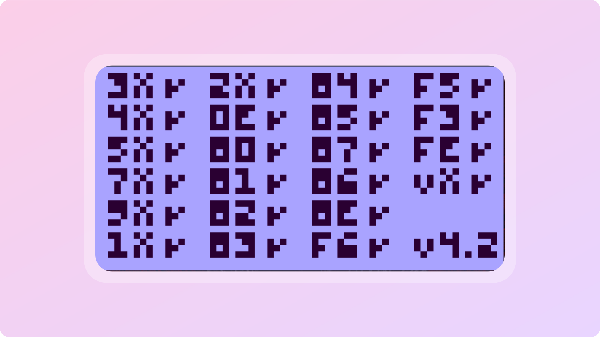

# CHIP-8pp
A simple CHIP-8 emulator written in C++

<p align="center">
    
    
    
</p>

Passed __all the tests__ from the [Timendus chip8-test-suite](https://github.com/Timendus/chip8-test-suite).

<p align="center">
    
    
</p>

## Table of content

- [Getting started - Installation](#getting-started)
- [Build and Run](#build-and-run)
    - [Classical way (local)](#classical-way-local)
        - [Build](#build)
        - [Run](#run)
    - [Docker container](#docker-container)
        - [Docker compose](#docker-compose--env-file)
        - [Bash script](#bash-script)
- [Miscellaneous](#miscellaneous)
- [Acknowledgement](#acknowledgement)       

## Getting started

First clone this repository

```bash
git clone <repository_url>
```

## Build and Run

### Classical way (local)

#### Build

You can create a `build` folder and execute the following commands:

```bash
mkdir build
cd build
cmake ..
make
```

The generated executable is called `emulator`.

#### Run

There are 3 options required to correctly run the emulator:
 - ROM path
 - Resolution scale factor
 - CPU cycle delay

Here's an example command to properly use the binary:

```bash
./emulator roms/pong.ch8 10 1
```

### Docker container

You can build the project's container by running this command:

```bash
docker build -t chip8pp .
```

Then, two options can be considered to run the container.

#### Docker compose & .env file

To run the container this way, you have to create a __.env__ file following the `.env.example` template. 

##### Granting access to X11 (Linux only)

On Linux, you need to grant access to the X11 server for Docker, because SDL needs to open a graphical window.
If you choose to use the Docker Compose command, you must first run the following command:

```bash
xhost +local:docker
```
>Note: This is required only if you are using the X11 display server.
On systems running Wayland (e.g., recent Ubuntu, Fedora), additional configuration may be needed, as xhost might not be sufficient.

Then just run the following command:

```bash
docker compose run --rm chip8pp
```

Note that you can also specify one or more arguments to override the values in `.env`.
Here's an example

```bash
ROM_PATH=roms/superpong.ch8 docker compose run --rm chip8pp
```

#### Bash script

There's also a __script__ that you can use to run the container. It requires 3 arguments (same as before) to run properly. You can use it like this:

```bash
./run_container.sh -r roms/pong.ch8 -s 10 -d 1
```

## Miscellaneous

Here are some bonus features/modes

| Key |       function      |
|-----|:-------------------:|
|__m__| Mute emulator sound |

## Acknowledgement

I would like to thank __Cowgod's__ for the amazing [Chip-8 Technical Reference](http://devernay.free.fr/hacks/chip8/C8TECH10.HTM) and __Timendus__ for the [CHIP-8 test suite repository](https://github.com/Timendus/chip8-test-suite).

These resources allowed me to precisely understand how Chip-8 works and test/debug the emulator properly !
